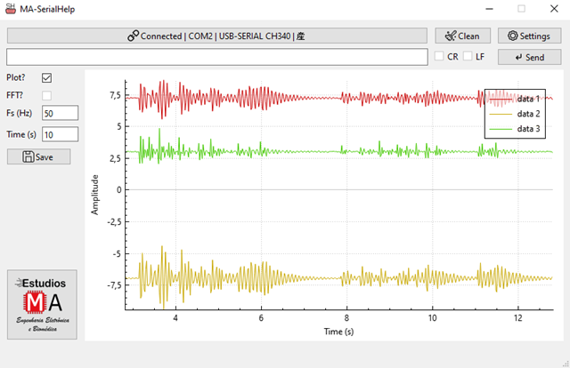

# 🖥️ MA-SerialHelp

**MA-SerialHelp** is a tool developed for the online visualization and recording of signals acquired by serial communication devices. It offers an intuitive interface and is optimized for educational, research, and experimental use.

---

## 🚀 Software Features

- ✅ Direct and easy connection to serial port (COM) based devices.
- 📈 Online visualization of signals in the time domain.
- 💾 Log data to `.txt` text files for later analysis.
- ⚙️ Setting key parameters for visualization, such as sampling rate (Fs) and time window length.

---

## Interface elements

1. **Connect / Disconnect**  
   Establishes or terminates a connection to a serial device.

2. **Settings**  
   Allows you to select the COM port and configure the device's communication parameters.

3. **Clean**  
   Clears the current graph

4. **Send**  
   Send commands to the device through the serial port.

5. **Plot**  
   - Enabled: Displays the received data in a real-time graph.
   - Disabled: Displays data in text format, without graphing.

6. **Fs (Hz)**  
   - Sets the sampling rate to be used to graph the time axis.
   👉 *Important*: This **Fs** does not change the device's sampling rate; it simply tells the monitor how to distribute the data along the time axis, assuming it arrives periodically.

7. **Time (s)**  
   - Define the visible length of the graph in seconds.
   *Example*: If set to 10 s, the window will display only the last 10 seconds of data, scrolling automatically as new data arrives.

8. **Save**  
   Save the graphed data to a text file for later analysis.

9. **Graph**  
   Main area where the signal is displayed (Amplitude vs. Time), dynamically updated.

10. **Text input**  
   Field to send manual commands to the device via serial.

---

## 📌 System Requirements

- Operating system: **Windows 7,8,10 or 11**.
- USB port.

---

## 📥 Easy download and installation

Just donwload and run the **MA-SerialHelp vX.X.exe** file and follow the on-screen instructions.

---

## 📣 Do you have questions or need support?

📲 **Contact me directly by:**  

🇪🇨 [**WhatsApp EC**](https://wa.me/593979287659?text=Hello%21+I+wish+to+purchase+the+device+%2AAccelHelp)  
🇧🇷 [**WhatsApp BR**](https://wa.me/5521998957829?text=Hello%21+I+wish+to+purchase+the+device+%2AAccelHelp)

📧 **Email:**  
estudiosma01@gmail.com

---

## Credits and attribution

This project was developed by **Estudios MA**, with a focus on biomedical acquisition systems and signal analysis.

If you use this code, hardware, or documentation as part of your personal or academic project, **please reference:**

Molina-Vidal, D.A., Estudios MA (2025). *SerialHelp*. Available online: https://github.com/estudiosma/SerialHelp

---

## ✍️ Author

**Estudios MA – Electronic and Biomedical Engineering**  
Eng. Danilo Molina, M.Sc  
📧 estudiosma01@gmail.com  
🌐 [https://linkfly.to/EstudiosMA](https://linkfly.to/EstudiosMA)