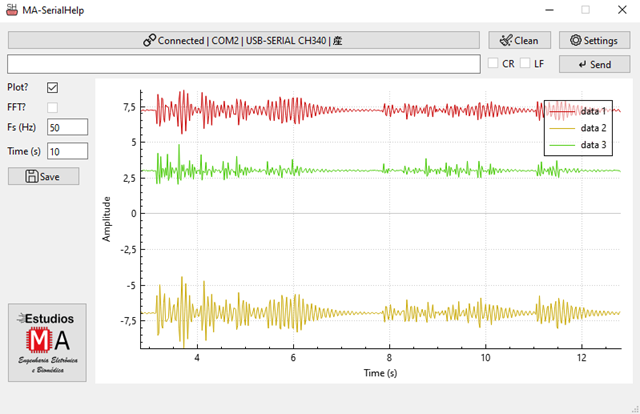
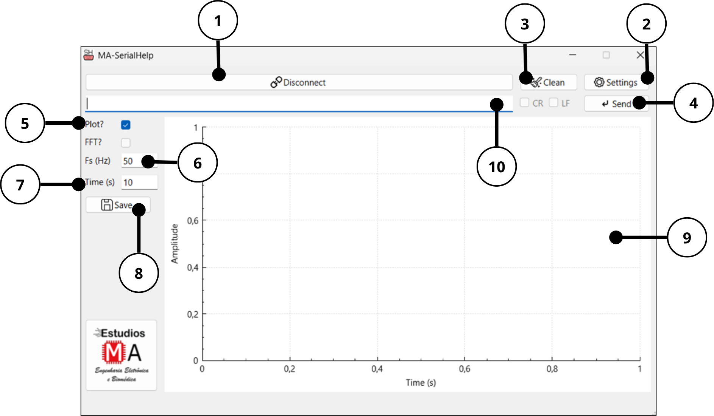

# 🖥️ MA-SerialHelp

**MA-SerialHelp** es una herramienta desarrollada para visualización y registro online las señales adquiridas por dispositivos con comunicación serial. Ofrece una interfaz intuitiva y está optimizado para uso educativo, investigativo y experimental.

---

## 🚀 Características del software

- ✅ Conexión directa y sencilla con dispositivos basados en puertos seriales (COM).
- 📈 Visualización online de señales en el dominio del tiempo.
- 💾 Registro de datos en archivos de texto `.txt` para análisis posterior.
- ⚙️ Configuración de parámetros clave para la visualización, como frecuencia de muestreo (Fs) y duración de la ventana de tiempo.

---

## Elementos de la interfaz

1. **Connect / Disconnect**  
   Establece o finaliza la conexión con un dispositivo serial.

2. **Settings**  
   Permite seleccionar el puerto COM y configurar parámetros de comunicación del dispositivo.

3. **Clean**  
   Limpia la gráfica actual.

4. **Send**  
   Envía comandos al dispositivo por el puerto serial.

5. **Plot**  
   - Activada: Visualiza los datos recibidos en una gráfica en tiempo real.
   - Desactivada: Muestra los datos en formato de texto, sin graficarlos.

6. **Fs (Hz)**  
   - Establece la frecuencia de muestreo que se usará para graficar el eje de tiempo.
   👉 *Importante*: Esta **Fs** no modifica la frecuencia de muestreo del dispositivo; solo le indica al monitor cómo distribuir los datos en el eje temporal, suponiendo que llegan de forma periódica.

7. **Time (s)**  
   - Define la longitud visible de la gráfica en segundos.
   *Ejemplo*: si se establece en 10 s, la ventana mostrará solo los últimos 10 segundos de datos, desplazándose automáticamente a medida que llegan nuevos datos.

8. **Save**  
   Guarda los datos graficados en un archivo de texto para análisis posterior.

9. **Gráfica**  
   Área principal donde se visualiza la señal (Amplitud vs. Tiempo), actualizada dinámicamente.

10. **Entrada de texto**  
   Campo para enviar comandos manuales al dispositivo a través del serial.

---

## 📌 Requisitos del sistema

- Sistema operativo: **Windows 7,8,10 o 11**
- Puerto USB

---

## 📥 Descarga e Instalación simple

Solo ejecuta el archivo **MA-SerialHelp vX.X.exe** y sigue las instrucciones en pantalla.

---

## 📣 ¿Tienes dudas o deseas soporte?

📲 **Contáctame directamente por WhatsApp:**  
[https://wa.me/593979287659](https://wa.me/593979287659)

📧 **Correo electrónico:**  
estudiosma01@gmail.com

---

## Créditos y atribución

Este proyecto fue desarrollado por **Estudios MA**, con enfoque en sistemas de adquisición biomédicos y análisis de señales.

Si usas este código, hardware o documentación como parte de tu proyecto personal o académico, **por favor referencia:**

Molina-Vidal, D.A., Estudios MA (2025). *AccelHelp*. Available online: https://github.com/estudiosma/AccelHelp

---

## ✍️ Autor

**Estudios MA – Electronic and Biomedical Engineering**  
Eng. Danilo Molina, M.Sc  
📧 estudiosma01@gmail.com  
🌐 [https://linkfly.to/EstudiosMA](https://linkfly.to/EstudiosMA)